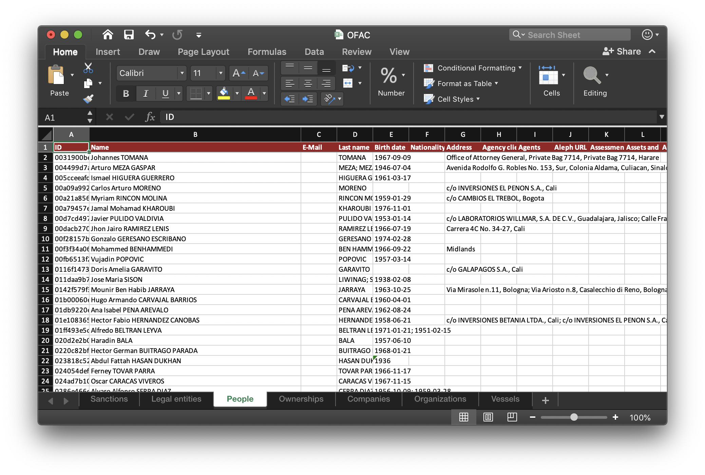
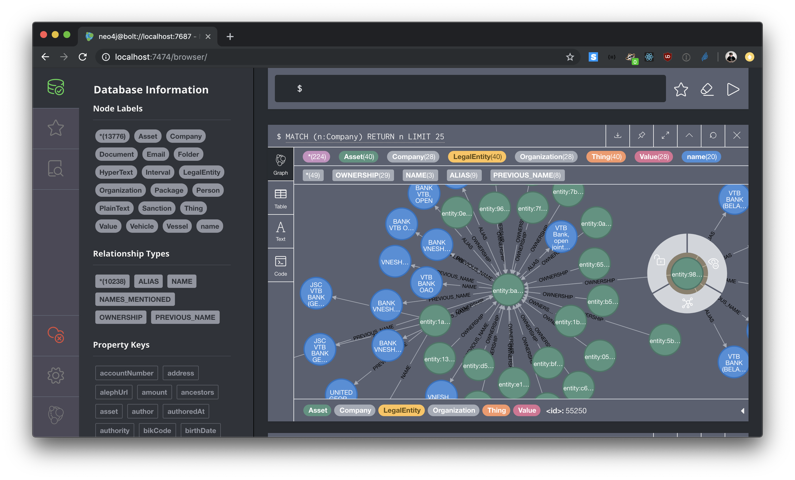
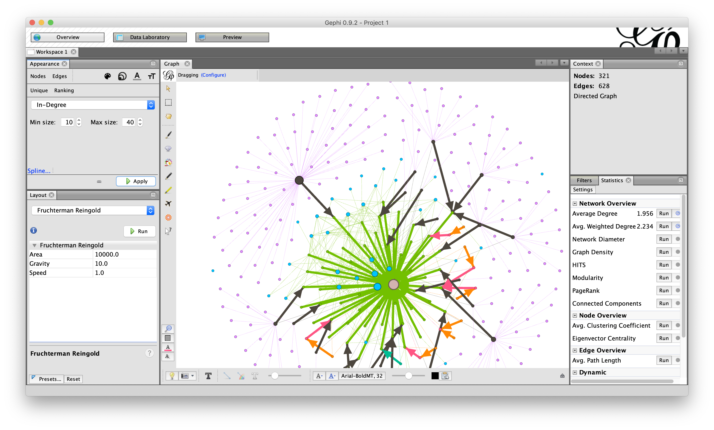

# Command-line tool

The `ftm` command generates, transforms, and exports [streams of entities](index.md) in line-based JSON. Typical uses:

- Convert structured tables (CSV, SQL) into entities by applying a [mapping](mappings.md).
- Reshape, aggregate, validate, or filter an existing entity stream.
- Export a stream to another format — CSV, Excel, Gephi GEXF, Cypher for Neo4J, or RDF.

Every command reads from stdin and writes to stdout unless told otherwise, so commands chain with pipes. Almost every command accepts `-i/--infile` and `-o/--outfile`; pass `-` to force stdin or stdout explicitly.

## Installation

`ftm` ships with the `followthemoney` Python package:

```bash
pip install followthemoney
ftm --help
```

`followthemoney` transliterates text between scripts to support fuzzy name comparison, which requires the `pyicu` bindings and a system-level ICU library. On Debian-based systems:

```bash
apt install libicu-dev
pip install pyicu
```

For other platforms, see the [pyicu installation notes](https://gitlab.pyicu.org/main/pyicu#installing-pyicu).

## The entity stream format

Commands exchange entities as newline-delimited JSON — one entity object per line, no pretty-printing. Files in this format use the extension `.ijson` or `.ftm`. A single entity looks like this:

```json
{"id": "person-1", "schema": "Person", "properties": {"name": ["Jane Doe"]}}
```

Streams can be piped through multiple commands without decoding overhead, and large files can be processed incrementally. If you need a human-readable view, pipe through [`ftm pretty`](#formatting-streams).

The writer always emits `id` as the first key in each line. Because the lines are sortable as plain text — every line starts with `{"id":"<id>"` — a standard `sort` pipeline orders an entity stream by ID without any JSON-aware tooling. The same property holds for line-based statement streams, which begin with `{"canonical_id":"<id>"`.

This matters because Unix `sort` is fast, uses external merge sort to spill to disk when the input exceeds memory, and parallelizes across cores with `--parallel`. It scales to datasets of tens or hundreds of gigabytes without special infrastructure, which is what makes [`ftm sorted-aggregate`](#aggregating-fragments) and [`ftm aggregate-statements`](#statement-based-workflows) practical beyond what `ftm aggregate` can handle in memory.

## Generating entities from tables

### Executing a mapping

Mappings project structured data (CSV or SQL) into FtM entities according to a [YAML mapping file](mappings.md). Run a mapping with `ftm map`:

```bash
curl -o md_companies.yml https://raw.githubusercontent.com/alephdata/aleph/main/mappings/md_companies.yml
ftm map md_companies.yml > moldova.ijson
```

This produces a stream of `Company`, `LegalEntity`, and relational entities covering Moldovan companies and their directors.


By default, `ftm map` signs every entity ID with the dataset's namespace, so IDs are unique within that dataset. Pass `--no-sign` to emit bare IDs instead — useful when downstream tools handle their own namespacing, or when you want the IDs to match across producers.

The dataset name comes from the top-level key in the mapping file. Override it with `-d/--dataset` when generating the same entities under a different dataset label:

```bash
ftm map -d md_companies_test md_companies.yml > staging.ijson
```

A mapping often generates multiple fragments per entity — one from each query that touches the entity. See [Aggregating fragments](#aggregating-fragments) for how to merge them.

### Mapping from a local CSV

`ftm map-csv` runs the same logic against CSV data piped in on stdin, ignoring any `csv_url` in the mapping file:

```bash
cat people_of_interest.csv | ftm map-csv people_of_interest.yml > people.ijson
```

This is the right tool when the source data is local, private, or dynamically produced.

### Mapping file structure

See the [mappings reference](mappings.md) for the YAML schema, including keys, filters, property transformations, and multi-table joins.

## Validating and formatting streams

### Re-parsing and validating

`ftm validate` re-parses an entity stream, running every property value through its type's cleaner and dropping invalid values. Use it as a safety net before loading data into an index or a downstream system:

```bash
cat raw.ijson | ftm validate > clean.ijson
```

If a producer emits unclean data — stray whitespace, invalid country codes, malformed dates — validation normalizes what it can and drops the rest.

### Formatting for humans

`ftm pretty` indents each entity over multiple lines and is intended for eyeballing a stream in a terminal:

```bash
head -n 5 moldova.ijson | ftm pretty
```

Do not feed the output back into another `ftm` command — indented JSON is not a valid entity stream.

### Dumping the schema model

`ftm dump-model` writes the full FtM schema definition as a single JSON document:

```bash
ftm dump-model -o model.json
```

This is the same model described by the [schema explorer](../explorer/schemata/index.md), serialized for tools that want to consume it programmatically.

## Namespace signing

`ftm sign` applies an HMAC signature to every entity ID in a stream, scoping the IDs to a named [namespace](namespace.md):

```bash
cat entities.ijson | ftm sign -s md_companies > signed.ijson
```

Pass the namespace key with `-s/--signature`. Omitting it passes IDs through unchanged. Entity-typed property values are rewritten alongside the top-level IDs, so cross-entity references stay consistent within the namespace.

Use this when ingesting into a system (OpenAleph, multi-tenant yente) that expects signed IDs but your producer does not sign on emission.

## Aggregating fragments

When a mapping or pipeline emits multiple records for the same entity ID, those records need to be merged before indexing. Two commands handle this:

- `ftm aggregate` buffers the entire stream in memory, merging fragments as they arrive. Order-independent but memory-bound.
- `ftm sorted-aggregate` walks the stream once, buffering one entity at a time and merging any incoming fragment whose ID matches the buffered one. It emits the buffered entity as soon as a different ID appears. This runs in constant memory, but it only merges fragments whose occurrences are *adjacent* in the input. If the input is not sorted by ID, non-adjacent fragments of the same entity pass through unmerged without any warning.

```bash
cat moldova.ijson | ftm aggregate > moldova.aggregated.ijson
```

For streaming aggregation on a sorted input, Unix `sort` is sufficient because each JSONL line begins with the `id` field:

```bash
sort moldova.ijson | ftm sorted-aggregate > moldova.aggregated.ijson
```

!!! warning
    `ftm aggregate` holds the entire dataset in memory. For datasets that exceed available RAM, sort the stream first and use `ftm sorted-aggregate`, or use an on-disk store (see [Aggregating large datasets](#aggregating-large-datasets)).

## Filtering entities

`ftm sieve` removes schemas, properties, property types, or datasets from a stream:

```bash
# Drop all Passport entities
cat entities.ijson | ftm sieve -s Passport > filtered.ijson

# Strip note properties and phone numbers
cat entities.ijson | ftm sieve -p notes -t phone > redacted.ijson

# Keep only entities that are in dataset A but not dataset B
cat entities.ijson | ftm sieve -d 'a-b' > scoped.ijson
```

The `-d/--datasets` expression uses the [dataset query syntax](metadata.md): `a|b` for union, `a-b` for difference, `a&b` for intersection.

## Statement-based workflows

The [statement data model](statements.md) records each claim about an entity as an individual row with provenance. Three commands move between entity streams and statements:

- `ftm statements` decomposes an entity stream into a statement table.
- `ftm format-statements` converts statement tables between CSV, Parquet, and other formats.
- `ftm aggregate-statements` rolls a sorted statement table back into an entity stream.

A typical pipeline:

```bash
# Entities → statements (CSV, attributed to dataset 'md_companies')
cat moldova.ijson | ftm statements -d md_companies > statements.csv

# Statements → entities, reconstructing full records
ftm aggregate-statements -i statements.csv > rebuilt.ijson
```

`ftm aggregate-statements` expects the statement stream to be sorted by the canonical entity ID. If it is not, pre-sort it the same way as for `ftm sorted-aggregate`.

## Exporting to other formats

### Tabular exports: CSV and Excel

Each FtM schema has a distinct set of properties, so tabular exports produce one table per schema: `Person.csv`, `Company.csv`, `Ownership.csv`, and so on.

Write to an Excel workbook:

```bash
cat us_ofac.ijson | ftm validate | ftm export-excel -o OFAC.xlsx
```



!!! warning
    Excel has a hard limit of roughly one million rows per sheet, and most office programs struggle with workbooks larger than a few hundred megabytes. Export only small- and mid-size datasets to Excel.

Write a directory of CSV files:

```bash
cat us_ofac.ijson | ftm validate | ftm export-csv -o OFAC/
```

Each file in `OFAC/` is named after its schema and contains one row per entity of that schema.

### Graph exports: Cypher, GEXF, Neo4J bulk

FtM sees every unit of information as an entity with properties. To analyze a stream as a graph, you need to decide which entities and which property types become nodes and edges:

- Some schemas (`Directorship`, `Ownership`, `Family`, `Payment`, `Membership`, `Email`) carry edge annotations and naturally become edges between their referenced entities.
- Entity-typed properties (for example, `Email:emitters`) also form edges.
- Some property types (`email`, `identifier`, `name`, `address`) can be [reified](<https://en.wikipedia.org/wiki/Reification_(computer_science)>) into nodes of their own, with edges from each entity that carries that value. Pass these with repeated `-e/--edge-types` flags.

#### Cypher for Neo4J

Export a Cypher script that loads the data into a running Neo4J instance:

```bash
cat us_ofac.ijson | ftm export-cypher | cypher-shell -u user -p password
```

To reify specific property types into their own nodes:

```bash
cat us_ofac.ijson | ftm export-cypher -e name -e iban -e address
```



When working with data that contains document folder hierarchies (Aleph-style), the folder structure can dominate any path analysis. Remove it with Cypher:

```cypher
MATCH ()-[r:ANCESTORS]-() DELETE r;
MATCH ()-[r:PARENT]-() DELETE r;
MATCH (n:Page) DETACH DELETE n;
// Delete reified value nodes that connect to only one entity:
MATCH (n:name)    WHERE size((n)--()) <= 1 DETACH DELETE (n);
MATCH (n:email)   WHERE size((n)--()) <= 1 DETACH DELETE (n);
MATCH (n:address) WHERE size((n)--()) <= 1 DETACH DELETE (n);
```

To reset the database:

```cypher
MATCH (n) DETACH DELETE n;
```

#### Neo4J bulk import

For datasets too large for interactive `cypher-shell` loading, produce a directory of CSV files plus a shell script that invokes `neo4j-admin import`:

```bash
cat us_ofac.ijson | ftm export-neo4j-bulk -o neo4j_import/ -e iban -e address
```

This requires stopping the Neo4J server and running the generated script against an empty database.

#### GEXF for Gephi

[GEXF](https://gephi.org/gexf/format/) is the graph format used by [Gephi](https://gephi.org/) and related tools. Use it for quantitative graph analysis — centrality, PageRank, force-directed layouts — on graphs of tens of thousands of nodes:

```bash
cat us_ofac.ijson | ftm validate | ftm export-gexf -e iban -o ofac.gexf
```



### RDF export

Entity streams can be exported as NTriples:

```bash
cat us_ofac.ijson | ftm validate | ftm export-rdf > ofac.nt
```

The exporter maps each property to a fully qualified RDF predicate by default; pass `--unqualified` to emit short predicate names instead. The underlying FtM ontology is also published as [RDF/XML](https://followthemoney.tech/ns/ftm.xml), with mappings to FOAF and related vocabularies.

## Aggregating large datasets

`ftm aggregate` holds the full dataset in memory, which is impractical beyond tens of millions of entities or when fragments are produced by multiple workers. The separate [`followthemoney-store`](https://github.com/alephdata/followthemoney-store) package provides on-disk aggregation backed by SQLite or PostgreSQL.

Install with SQLite support:

```bash
pip install followthemoney-store
```

With PostgreSQL, which supports upserts and performs better under write contention:

```bash
pip install followthemoney-store[postgresql]
export FTM_STORE_URI=postgresql://localhost/followthemoney
```

A typical write-then-iterate flow:

```bash
cat us_ofac.ijson | ftm store write -d us_ofac
ftm store iterate -d us_ofac > aggregated.ijson
ftm store delete -d us_ofac
```

!!! warning
    When aggregating entities with very large text fragments, a per-entity size limit applies. Entities larger than 50 MB of raw text have additional fragments discarded with a warning written to stderr.

## Extending the CLI

`ftm` discovers additional commands through the `followthemoney.cli` Python entry-point group. Packages that install Click commands under this group appear automatically in `ftm --help` after installation. [`followthemoney-store`](https://github.com/alephdata/followthemoney-store) registers the `ftm store` subcommand this way, and [zavod](https://zavod.opensanctions.org/) adds its own commands in environments where it is installed.
